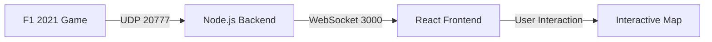

# Phase 1 Technical Documentation: F1 Telemetry Analysis

## 1. System Architecture
The suite is designed as a unidirectional data-flow pipeline to ensure minimal latency between car movement and UI updates.

---

## 2. The Map Discovery Engine
The most complex part of Phase 1 is the algorithmic discovery of track geometry.

### 2.1 Coordinate Tracing
Instead of using static images, the backend monitors the car's global `(X, Z)` coordinates every 250ms.
- **Logic**: If the car is moving and telemetry is active, coordinates are appended to a `trackPath` array.
- **Bounds calculation**: The system maintains a rolling `min/max` bounding box to normalize the view.

### 2.2 Persistence Strategy
To avoid re-mapping every session, we use a local JSON database:
- **Location**: `/f1-telemetry-backend/trackMaps/track_{ID}.json`
- **Trigger**: Mapping "Freezes" and saves after exactly **2 Laps** are completed, ensuring a clean closed-circuit loop.
- **Restoration**: Upon session start, the `trackId` is checked against the database; if a match is found, the live trace is skipped in favor of the cached high-definition geometry.

### 2.3 Perpendicular Feature Mapping
Sector lines (S1, S2) and Finish lines (FL) are stamped with exact car coordinates during the trace.
- **The Math**: To ensure lines sit perpendicular to the track, the frontend calculates the tangent between the points immediately before and after the marker using `Math.atan2(dz, dx)`.
- **Rotation**: A `+90°` offset is applied to align the vector line perfectly across the asphalt.

---

## 3. High-Resolution Vector Scaling
The `TrackMap.jsx` uses a custom scaling algorithm to prevent pixelation at high zoom levels.

### 3.1 Inverse Scaling Matrix
As the user zooms *in* on the map (e.g., scale = 30x), the map geometry expands. To keep the UI readable, we apply an **Inverse Scaling Factor** to:
- **Stroke Weights**: `stroke-width = base / currentScale`
- **Text Labels**: `font-size = base / currentScale`
- **Car Dots**: `radius = base / currentScale`

This ensures that while the track gets bigger, the "HAM" label remains its original, crisp 14px size on your monitor.

---

## 4. Session State & Data Integrity
The system distinguishes between **Live** and **Standby** states using a 2-second heartbeat watchdog in `broadcaster.js`.

### 4.1 Data Preservation
- **Leaderboards**: Cached in the React state. When the watchdog triggers "Standby", the leaderboard remains on screen, allowing drivers to review final session rankings.
- **HUD Sanitization**: Interactive elements (Steering Wheel, Radar) clear their active positions during Standby to prevent "ghost" data leftovers from previous sessions.

---

## 5. Configuration & Environments
Environment variability is handled through `.env` files and `config.json`.

| Parameter | Location | Description |
|-----------|----------|-------------|
| `PORT` | Node `.env` | The WebSocket broadcasting port. |
| `UDP_PORT` | Node `.env` | The port for receiving game packets. |
| `VITE_PORT` | React `.env` | The local development server port. |
| `traceTarget`| `config.json`| String name of the driver to follow for map generation (e.g., "VERSTAPPEN"). |

---

## 6. Phase 1 Feature Checklist
- [x] Full UDP Telemetry Normalization
- [x] High-Resolution Interactive Radar (Pan/Rotate/Zoom)
- [x] Persistent Circuit Cache System
- [x] Automated Sector & Finish Line Interception
- [x] Steering Wheel HUD with Real-time RPM/Gear/Pedals
- [x] Session Watchdog & Leaderboard Preservation
